# Penteam v2.0

**AI-Powered Smart Contract Security System**  
*Human-in-the-loop • Multi-Agent • Graph-Powered • Hallucination-Resistant*

**Last Updated**: February 27, 2026

## Overview & Vision

Penteam is a **human-in-the-loop multi-agent system** designed for high-signal Web3 bug bounty hunting and smart contract security analysis.

Instead of a single generalist LLM, Penteam uses a **Mixture of Experts (MoE)** architecture where specialized agents work together under a central **Coordinator**. The system is built on a rich **Knowledge Graph** to ground every claim in deterministic facts, eliminating hallucinations.

**Core Philosophy**:
- Signal-to-noise ratio > Autonomy
- Graph memory + deterministic rules first
- Adversarial Jury layer (different model families)
- Compiler (Foundry) as the ultimate truth oracle
- Human always in the loop for final validation

---

## Architecture

Penteam is divided into clear phases:

- **Phase 1–3**: Structural Intelligence Layer (Knowledge Graph + deterministic security signals)
- **Phase 4**: Multi-Agent Orchestration (Lead Coordinator + specialized Workers)
- **Phase 5**: Jury System (adversarial validation — in progress)
- **Phase 6**: Exploit Proof Layer (Test Writer Worker — **live**)
- **Phase 7+**: Confidence Scoring, Reports, SaaS (planned)

---

## End-to-End Pipeline

```mermaid
flowchart TB
    %% ─── PHASE 1: INGESTION ────────────────────────────────
    subgraph INGESTION["Phase 1 — Repository Ingestion"]
        direction TB
        A1["🔗 Git Clone + Submodules"]
        A2["📦 Dependency Install\n(npm / yarn / forge install)"]
        A3["🔍 Framework Detection\n(Foundry / Hardhat / Brownie)\nRecursive subdirectory scan"]
        A4["📐 Repo Size Classification\n(small / medium / large / xlarge)"]
        A5["🧩 Cluster Builder\nGroup by pragma + import graph"]
        A6["⚙️ Multi-Pragma Compilation\nFramework-first → cluster fallback\nsolc auto-switching per pragma"]
        A7["🔬 Slither Static Analysis\nIR parsing per cluster"]
        A8["🧹 Contract Deduplication\nMerge overlapping Slither objects"]
        A9["📊 Ingestion Report\nclusters / contracts / warnings"]

        A1 --> A2 --> A3 --> A4 --> A5 --> A6 --> A7 --> A8 --> A9
    end

    %% ─── PHASE 2: KNOWLEDGE GRAPH ──────────────────────────
    subgraph GRAPH["Phase 2 — Knowledge Graph Construction"]
        direction TB
        B1["🏗️ GraphBuilder\nNetworkX DiGraph"]
        B2["📍 Node Creation\nContracts • Functions • State Variables\nModifiers • StateTransitions • ExternalTargets"]
        B3["🔗 Edge Creation\nCALLS • READS • WRITES • PERFORMS • AFFECTS\nHAS_MODIFIER • INHERITS • EXTERNAL_CALL"]
        B4["🛡️ Security Metadata Enrichment\nReentrancy • CEI • Unprotected mutators\nPrivilege escalation • Write propagation\nStateTransitions • Array length mutation\nDelegatecall storage risk • Contract tiers"]
        B5["📈 Risk Scoring\nComposite score per function\n(0-100)"]

        B1 --> B2 --> B3 --> B4 --> B5
    end

    %% ─── PHASE 3: COORDINATOR ──────────────────────────────
    subgraph COORD["Phase 3 — Coordinator Orchestration"]
        direction TB

        C1["🕵️ Step 1: Recon Worker\nProtocol classification\nRAG knowledge retrieval\nEtherscan on-chain history\n→ Security Dossier"]

        C2["🎯 Step 2: Hotspot Detection\nget_high_risk_hotspots()\nDeterministic graph query\nmin_score=70"]

        subgraph ATTACK["Step 3: Attack Hypothesis Workers"]
            direction LR
            D1["Worker 1\nreentrancy"]
            D2["Worker 2\naccess control"]
            D3["Worker N\n..."]
        end

        C3["📋 Step 4: Build Findings\nFilter confidence > 0\nSort by confidence desc\nAttach evidence nodes"]

        C4["🧠 Step 5: LLM Synthesis\nCoordinator LLM\nJSON vulnerability report\nSeverity • Root cause\nImpact assessment"]

        subgraph TESTWRITER["Step 6: TestWriter — Exploit Proof"]
            direction TB
            E1["🏗️ Sandbox Setup\nCopy repo (Foundry root)\nSymlink lib/ • Wipe test/\nClean isolated environment"]
            E2["📝 Collect Source + Deps\nResolve target contract\nFollow import graph\nRemappings from foundry.toml"]
            E3["🤖 LLM: Generate Test\nFoundry PoC with\nfunction test_exploit()"]
            E4["✏️ Auto-Correct Imports\nFix paths from\nremappings.txt"]
            E5["🔨 forge test\n--match-test test_exploit\nCompile + run in one step"]
            E6{"✅ Exploit\nproven?"}
            E7["📤 Return Result\ntest_code + logs +\nconfidence adjustment"]
            E8["🔄 Retry with errors\nMax 6 attempts\nError history → LLM"]

            E1 --> E2 --> E3 --> E4 --> E5 --> E6
            E6 -->|Yes| E7
            E6 -->|No| E8 --> E3
        end

        C1 --> C2 --> ATTACK --> C3 --> C4 --> TESTWRITER
    end

    %% ─── PHASE 4: OUTPUT ───────────────────────────────────
    subgraph OUTPUT["Phase 4 — Final Output"]
        direction TB
        F1["📊 Vulnerability Report\n• PROVEN exploits (test code)\n• HIGH-confidence leads\n• Risk landscape summary"]
        F2["🚨 Human Escalation\nIf findings.confidence ≥ threshold"]
        F3["🗂️ Structured Data\nFindings + test code +\nlogs + graph export"]

        F1 --> F2
        F1 --> F3
    end

    %% ─── CONNECTIONS ───────────────────────────────────────
    INGESTION --> GRAPH
    GRAPH --> COORD
    COORD --> OUTPUT

    %% ─── STYLING ───────────────────────────────────────────
    classDef phase1 fill:#1a1a2e,stroke:#16213e,color:#e4e4e4
    classDef phase2 fill:#0f3460,stroke:#16213e,color:#e4e4e4
    classDef phase3 fill:#533483,stroke:#16213e,color:#e4e4e4
    classDef phase4 fill:#e94560,stroke:#16213e,color:#e4e4e4

    class INGESTION phase1
    class GRAPH phase2
    class COORD phase3
    class OUTPUT phase4
```



### Pipeline Step Details

| Step | Component | Input | Output | Parallelism |
|------|-----------|-------|--------|-------------|
| 1.1 | `RepoManager` | Git URL | Cloned repo + deps | Sequential |
| 1.2 | `FrameworkDetector` | Repo path | Framework instances (type + subdir) | Sequential |
| 1.3 | `ClusterBuilder` | .sol files + pragmas | Compilation clusters | Sequential |
| 1.4 | `AnalysisEngine.run_analysis_v2()` | Clusters | Merged Slither object | Per-cluster |
| 2.1 | `GraphBuilder` | Slither IR | NetworkX DiGraph (2000+ nodes) | Sequential |
| 3.1 | `ReconWorker` | Contract names + addresses | Security Dossier | Sequential |
| 3.2 | `get_high_risk_hotspots()` | Graph | Scored hotspots (min 70) | Deterministic |
| 3.3 | `AttackHypothesisWorker` | Hotspot + recon context | Attack path + confidence | **Parallel** (all hotspots) |
| 3.4 | `TestWriterWorker` | Finding + repo | Proven exploit or failure | Sequential (per finding) |
| 4.1 | Coordinator LLM | All results | JSON vulnerability report | Sequential |

---

## Core Components

### 1. Knowledge Graph (The Brain)
- Built from **Slither** IR analysis
- **NetworkX** DiGraph with 4000+ nodes typical
- **6 node types**: Contract, Function, StateVariable, Modifier, StateTransition, ExternalTarget
- **9 edge types**: DEFINES, INHERITS, CALLS, READS, WRITES, HAS_MODIFIER, EXTERNAL_CALL, PERFORMS, AFFECTS
- Rich security metadata:
  - Reentrancy risk, CEI violations, unprotected mutators, privilege escalation, reachability, write propagation
  - StateTransition operation classification (assign, add, sub, push, pop, decrement_length)
  - Array length mutation (AlienCodex primitive), delegatecall storage collision risk
  - Contract tier classification (CORE, FACTORY, LIBRARY, INFRA) with tier-weighted impact scoring
- Query API used by all agents (`get_high_risk_hotspots`, `get_function_context`, `get_state_transitions`, `get_contract_tiers`, etc.)

See **[Knowledge Graph Structure](#knowledge-graph-structure)** below for the complete schema.

### 2. Lead Coordinator
- Pure orchestrator (never analyzes code directly)
- Maintains global state using LangGraph
- Spawns workers in parallel
- Synthesizes findings
- Decides escalation to human
- Uses only high-level summary tools

### 3. Workers (Mixture of Experts)

**Recon Worker**
- Gathers protocol intelligence (RAG + Etherscan history)
- Classifies protocol type (Vault, DEX, Lending, etc.)
- Produces Security Dossier for downstream workers

**Attack Hypothesis Worker**
- Takes hotspots + recon context
- Generates structured vulnerability hypotheses
- Must cite real node IDs from the graph
- Produces `attack_path` and confidence score

**Test Writer Worker** (Live)
- Receives a finding
- Generates Foundry test code
- Runs isolated compile → test → fix loop (max 6 attempts)
- Uses real `forge build` and `forge test`
- Returns proven exploit or detailed failure reason
- Sandboxed using `tempfile` + `SandboxManager`

### 4. Ingestion Engine (v2)
- **Framework Detection**: Recursive scan for Foundry/Hardhat/Brownie in subdirectories
- **Cluster Compilation**: Groups files by pragma version + import graph
- **Framework-First Strategy**: Compiles framework directories as whole units
- **Multi-Pragma Support**: Auto-switches solc per compilation cluster
- **Memory Guard**: Classifies repos by size, prevents memory explosions
- **Contract Deduplication**: Merges overlapping Slither objects after multi-cluster compilation

### 5. Tools & Infrastructure
- **Graph Tools**: `get_high_risk_hotspots`, `get_function_context`, etc.
- **RAG Librarian**: ChromaDB + embeddings for audit reports & docs
- **Etherscan Client**: On-chain history + exploit heuristics
- **AnalysisEngine**: Slither + auto solc version switching
- **RepoManager**: Git clone + Foundry/Hardhat dependency handling
- **SandboxManager**: Isolated Foundry environment per test attempt

### 6. Jury System (In Progress)
- Multi-model adversarial validation
- Sanity Jury (grounding)
- Logic Jury ("Prove this vulnerability is FALSE")
- Uses different model families (Gemini, GPT-5, Claude 4.6, Grok 4)

---

## Knowledge Graph Structure

The Knowledge Graph is a **NetworkX DiGraph** built from Slither IR. Every node and edge carries typed metadata used for deterministic vulnerability detection and hotspot ranking.

### Node Types (6)

#### Contract

- **ID format**: `ContractName` (e.g. `Vault`)
- **Properties**: `name`, `is_upgradeable`, `is_library` (Solidity `library` keyword), `is_interface` (Solidity `interface` keyword), `tier` (`CORE`|`FACTORY`|`LIBRARY`|`INFRA`), `privileged_roles` (list of RoleProfile dicts)

#### Function

- **ID format**: `ContractName::FunctionName` (e.g. `Vault::withdraw`)
- **Attack surface**: `visibility`, `stateMutability`, `is_external_entry`, `is_view_or_pure`, `is_payable`, `is_constructor`, `is_fallback`, `is_receive`, `signature`, `source_code`, `modifiers`
- **State mutation**: `writes_state`, `num_state_writes`, `state_variables_written`, `propagated_state_variables`, `indirect_writes_state`, `propagation_depth`
- **External calls**: `makes_external_call`, `external_call_type`, `external_call_nodes`, `state_write_after_external_call`, `state_write_after_reentrant_call`
- **Access control**: `has_access_control`, `access_control_modifiers`, `has_inline_access_check`, `is_protected`, `is_unprotected_mutator`, `unprotected_risk_level`
- **Reentrancy**: `reentrancy_risk`, `reentrancy_risk_score`, `cei_violation_only`
- **Reachability**: `reachable_from_external_entry`, `entry_points`
- **Privilege**: `can_escalate_privileges`
- **Epic 6**: `has_array_length_mutation`, `delegatecall_storage_risk`
- **Epic 8 Oracle**: `uses_spot_price_oracle`, `uses_safe_oracle`, `uses_twap_oracle`, `oracle_sources` (list), `oracle_manipulation_risk`, `oracle_risk_score`, `twap_window_short`
- **Epic 8 Arithmetic**: `division_before_multiplication`, `has_unchecked_arithmetic`, `unchecked_with_state_write`, `unsafe_type_cast`, `arithmetic_risk_score`
- **Epic 8 Signature**: `uses_signature_validation`, `signature_includes_chainid`, `signature_includes_nonce`, `signature_includes_expiry`, `signature_marks_used`, `signature_replay_risk`
- **Risk scores**: `structural_score`, `exploitability_score`, `impact_score`, `final_score`, `risk_score` (alias), `risk_categories`

#### StateVariable

- **ID format**: `ContractName::VariableName` (e.g. `Vault::balance`)
- **Properties**: `name`, `contract`, `declaring_contract`, `storage_location` (always `"storage"`), `roles_using_variable`, `functions_modifying_variable`, `privilege_escalation_risk`, `risky_mutators`

#### Modifier

- **ID format**: `ContractName::modifier::ModifierName` (e.g. `Vault::modifier::onlyOwner`)
- **Properties**: `name`, `contract`, `conditions` (list of parsed require/assert), `accesses_state_variables`, `is_access_control`, `access_control_pattern` (`owner_check`|`role_mapping`|`boolean_flag`|`tx_origin`|`custom`|`none`), `pre_segment`, `post_segment`

#### StateTransition (Epic 6)

- **ID format**: `__st::{FunctionNodeId}::{counter}` (e.g. `__st::Vault::withdraw::0`). Counter is auto-incrementing per `build_graph()` call; **not stable across runs**. Use `function` + `variable` + `operation` as semantic key.
- **Dedup rule**: at most one StateTransition per `(function, variable, operation)` triple.
- **Properties**:

| Property | Type | Description |
|----------|------|-------------|
| `function` | `str` | Source function node ID |
| `variable` | `str` | Target state variable node ID |
| `operation` | `str` | `assign` \| `add` \| `sub` \| `push` \| `pop` \| `decrement_length` \| `delete` |
| `is_array_length` | `bool` | True if operation mutates array length (pop/decrement_length) |
| `is_array` | `bool` | True if target variable type contains `[]` |
| `is_mapping` | `bool` | True if target variable type contains `mapping` |
| `is_owner_assignment` | `bool` | True if writing to owner/admin-type variable or a variable used in access control |
| `attacker_controlled_input` | `bool` | True if a function parameter or `msg.value` appears in the write expression (see detection method below) |
| `affects_privileged_var` | `bool` | True if the variable is used as the underlying variable of a privileged role |
| `ir_expression` | `str` | Source-level expression string from Slither CFG |

**`attacker_controlled_input` detection method**: Shallow string-match heuristic, not taint analysis. For `public`/`external` functions, checks if any parameter name (as a substring) or `msg.value` appears in the CFG node's expression string. False positives possible with short parameter names. Does NOT track inter-node or inter-procedural dataflow.

**Operation taxonomy scope**: `mul`, `div`, bitwise operations all map to `assign` — only `+=`, `-=`, `.push()`, `.pop()`, `.length--`, and IR-level `Push`/`Delete` are classified distinctly. This is intentional at the current analysis granularity.

#### ExternalTarget

- **ID format**: `__ext::{CallerFunctionId}::{counter}` (e.g. `__ext::Vault::withdraw::0`)
- **Created when**: An external call's target cannot be resolved to an existing in-graph Function node. Typically for low-level calls (`address.call`), cross-repo interfaces, or unresolved dynamic targets.
- **Properties**:

| Property | Type | Description |
|----------|------|-------------|
| `target_expression` | `str` | Raw call target string from IR, e.g. `"recipient.call"`, `"token.transferFrom"` |

**Not present**: No `contract_address`, `is_trusted`, `known_abi`, or `resolved_address` — ExternalTarget is a minimal placeholder for unresolved call destinations.

### Edge Types (9)

| Edge | Source → Target | When Created | Properties |
|------|-----------------|--------------|------------|
| **DEFINES** | Contract → Function | Every function in a contract | — |
| **INHERITS** | Contract → Contract | For each parent in inheritance chain | — |
| **CALLS** | Function → Function | Internal calls within same/inherited contracts (from `function.internal_calls`) | `call_type="internal"` |
| **READS** | Function → StateVariable | For each state variable read by the function | — |
| **WRITES** | Function → StateVariable | For each state variable written by the function. Legacy; also modeled via PERFORMS→AFFECTS for richer semantics. | — |
| **HAS_MODIFIER** | Contract → Modifier | For each modifier defined on a contract | — |
| **EXTERNAL_CALL** | Function → Function *or* ExternalTarget | For each external call in function body or applied modifiers. Target is an existing Function if Slither resolves it, otherwise an ExternalTarget node. | `call_type` (`call`\|`delegatecall`\|`staticcall`\|`transfer`\|`send`\|`interface`), `forwards_gas` (`full`\|`2300`\|`unknown`), `target_expression` (str), `return_value_checked` (bool) |
| **PERFORMS** | Function → StateTransition | For each classified state write operation in the function | — |
| **AFFECTS** | StateTransition → StateVariable | From each StateTransition to the variable it modifies | — |

**CALLS vs EXTERNAL_CALL**: `CALLS` edges represent same-contract (or inherited) internal calls, derived from `function.internal_calls`. `EXTERNAL_CALL` edges represent cross-trust-boundary calls detected via Slither IR (`LowLevelCall`, `HighLevelCall`, `Transfer`, `Send`). They are mutually exclusive.

### Graph Topology

```
Contract ──DEFINES──► Function
Contract ──INHERITS─► Contract
Contract ──HAS_MODIFIER──► Modifier

Function ──CALLS──► Function            (internal calls)
Function ──READS──► StateVariable
Function ──WRITES─► StateVariable       (legacy, kept for backward compat)
Function ──PERFORMS──► StateTransition ──AFFECTS──► StateVariable
Function ──EXTERNAL_CALL──► Function    (resolved cross-contract call)
Function ──EXTERNAL_CALL──► ExternalTarget  (unresolved target)
```

### Build Pipeline (21 steps)

```
 1. _add_contract_node        — Contract nodes (name, is_library, is_interface, is_upgradeable)
 2. _add_inheritance_edges    — INHERITS edges
 3. _add_function_node        — Function nodes (visibility, payable, source_code, etc.)
 4. _add_edge_defines         — DEFINES edges
 5. _add_call_edges           — CALLS edges (internal)
 6. _add_state_access_edges   — READS + WRITES edges, StateVariable nodes
 7. _enrich_storage_mutations — writes_state, num_state_writes, state_variables_written
 8. _enrich_internal_calls    — internal_calls, is_leaf_function
 9. _build_state_transitions  — StateTransition nodes + PERFORMS/AFFECTS edges     [Epic 6]
10. _propagate_writes         — propagated_state_variables via DFS through CALLS
11. _compute_reachability     — reachable_from_external_entry via DFS from entries
12. _enrich_access_control    — Modifier nodes, HAS_MODIFIER edges, access profiles
13. _classify_external_calls  — EXTERNAL_CALL edges + ExternalTarget nodes, CEI flags
14. _detect_oracle_patterns   — oracle usage, manipulation risk, TWAP window        [Epic 8]
15. _detect_arithmetic_patterns — div-before-mul, unchecked, unsafe cast            [Epic 8]
16. _detect_signature_patterns  — sig validation, replay risk                       [Epic 8]
17. _detect_reentrancy_risks  — reentrancy_risk, reentrancy_risk_score, cei_violation_only
18. _detect_privileged_roles / _detect_unprotected_mutators / privilege propagation
19. _enrich_state_transitions — is_owner_assignment, affects_privileged_var          [Epic 6]
    _detect_array_length_mutations — has_array_length_mutation                      [Epic 6]
    _detect_delegatecall_storage_risk — delegatecall_storage_risk                   [Epic 6]
20. _classify_contract_tiers  — tier on Contract nodes                              [Epic 7]
21. _compute_global_risk_scores — structural/exploitability/impact/final scores
```

**Note**: `_propagate_writes` (step 10) uses legacy `WRITES` edges and `state_variables_written`, NOT StateTransition/PERFORMS/AFFECTS chains. The two systems are intentionally independent: WRITES for propagation, StateTransitions for per-operation semantics.

### Contract Tier Classification (Epic 7)

Each Contract has a `tier`. Priority order (first match wins):

| Tier | Detection Rule | Impact Adjustment |
|------|----------------|-------------------|
| **FACTORY** | Any function contains `NewContract` IR op or `new ClassName(` in source | −25 impact |
| **LIBRARY** | `is_library==True` OR `is_interface==True` OR zero external entries | Excluded from hotspots |
| **CORE** | Has ≥1 external entry AND ≥1 function makes external calls | +20 impact |
| **INFRA** | Default (has entries, no external calls) | — |

A Solidity `library` can **never** be tier=CORE — LIBRARY check has strict priority over CORE.

### Risk Score Formula (complete)

Risk scoring has two phases: **pre-scoring** (per-detector, additive to `risk_score`) and **global scoring** (`_compute_global_risk_scores`, multi-dimensional).

#### Phase 1 — Pre-scoring (added directly by detection methods)

```python
# Epic 8.1 — Oracle manipulation
if oracle_manipulation_risk:                        risk_score += 120

# Epic 8.2 — Arithmetic patterns (stack)
if unchecked_with_state_write:                      risk_score += 50
if division_before_multiplication:                  risk_score += 40
if unsafe_type_cast:                                risk_score += 35

# Epic 8.3 — Signature replay
if signature_replay_risk:                           risk_score += 100
```

#### Phase 2 — Global scoring (`_compute_global_risk_scores`)

```python
# ── STRUCTURAL SCORE ─────────────────────────────────────────
structural = 0
if reentrancy_risk:                                 structural += 50
if can_escalate_privileges:                         structural += 50
if is_unprotected_mutator:                          structural += 40
if cei_violation_only                               structural += 15
  OR (state_write_after_external_call
      AND NOT reentrancy_risk):                     structural += 15
if has_array_length_mutation:                       structural += 40   # Epic 6
if delegatecall_storage_risk:                       structural += 50   # Epic 6

# ── EXPLOITABILITY SCORE ─────────────────────────────────────
exploitability = 0
if reachable_from_external_entry:                   exploitability += 30
if has_EXTERNAL_CALL_edge with
   call_type in (call, delegatecall)
   AND forwards_gas != "2300":                      exploitability += 30
if is_external_entry:                               exploitability += 10
if NOT is_protected AND NOT is_view_or_pure:        exploitability += 15
if any StateTransition has
   attacker_controlled_input == True:               exploitability += 15

# ── IMPACT SCORE ─────────────────────────────────────────────
impact = 0
impact += min(30, 5 * len(propagated_state_variables))
if is_payable:                                      impact += 20
if can_escalate_privileges:                         impact += 30
if is_unprotected_mutator:
    if unprotected_risk_level == "HIGH":            impact += 20
    else:                                           impact += 10

# Tier adjustment (applied last, then clamped)
if contract.tier == "CORE":                         impact += 20
elif contract.tier == "FACTORY":                    impact -= 25
impact = max(0, impact)

# ── FINAL SCORE ──────────────────────────────────────────────
final_score = round(structural * 0.40 + exploitability * 0.35 + impact * 0.25)
risk_score  = final_score   # overwrites pre-score; backward-compat alias
```

#### `risk_categories` values

`reentrancy`, `privilege_escalation`, `unprotected_mutator`, `cei_violation`, `array_length_mutation`, `delegatecall_storage_risk`, `oracle_manipulation`, `unchecked_arithmetic`, `division_before_multiplication`, `unsafe_type_cast`, `signature_replay`

### Hotspot Selection Gate

A function becomes a hotspot only if ALL conditions pass:

1. `final_score >= 70`
2. `structural_score >= 40`
3. `exploitability_score >= 30`
4. NOT `is_view_or_pure`
5. NOT `is_constructor`
6. NOT matching test/mock/fuzzing contract name patterns
7. NOT in a `LIBRARY`-tier contract

### Query API (21 methods)

| Method | Returns | Purpose |
|--------|---------|---------|
| `get_high_risk_hotspots(min_score, min_structural, min_exploitability)` | `List[Hotspot]` | Scored hotspots for agent dispatch |
| `get_function_context(node_id)` | `Dict` | Source code + callers/callees |
| `find_state_mutators(variable_name)` | `List[str]` | Function IDs writing a variable |
| `get_modifiers(function_id)` | `List[str]` | Applied modifier names |
| `verify_existence(node_name)` | `bool` | Node existence check |
| `get_external_entry_points(contract_name)` | `List[Dict]` | Externally callable functions |
| `get_state_mutators(contract_name)` | `List[Dict]` | State-mutating functions with write counts |
| `get_internal_calls(function_id)` | `List[str]` | Direct callees |
| `get_callers(function_id)` | `List[str]` | Direct callers |
| `get_call_graph(contract_name)` | `Dict` | Structured nodes + edges for visualization |
| `get_modifier_details(name, contract)` | `Dict` | Modifier with conditions and pattern |
| `get_access_control_summary(contract)` | `List[Dict]` | All functions with access profiles |
| `get_privileged_roles(contract)` | `List[Dict]` | Detected roles with protected functions |
| `get_unprotected_mutators(contract)` | `List[Dict]` | Unprotected state mutators |
| `get_external_call_functions(contract)` | `List[Dict]` | Functions making external calls with CEI status |
| `get_external_call_edges(function_id)` | `List[Dict]` | EXTERNAL_CALL edge properties from a function |
| `get_reentrancy_risks(contract)` | `List[Dict]` | Reentrancy-flagged functions |
| `get_cei_violations(contract)` | `List[Dict]` | CEI-only violations (non-reentrant) |
| `get_privilege_escalation_risks(contract)` | `Dict` | `risky_functions` + `risky_variables` |
| `get_state_transitions(function_id, variable_id, contract_name, operation)` | `List[Dict]` | StateTransition nodes with filters |
| `get_array_length_mutations(contract)` | `List[Dict]` | Functions with array length mutation primitives |
| `get_delegatecall_storage_risks(contract)` | `List[Dict]` | Functions flagged with delegatecall storage collision |
| `get_contract_tiers(tier)` | `List[Dict]` | Contract tier classifications |
| `get_contract_signatures(contract_name)` | `Dict[str,str]` | Function name → signature mapping |

---

## Tech Stack

- **Language**: Python 3.12+
- **Orchestration**: LangGraph + LangChain
- **Graph**: NetworkX
- **Static Analysis**: Slither
- **Testing**: Foundry (Forge)
- **Vector DB**: ChromaDB
- **Embeddings**: all-MiniLM-L6-v2
- **LLMs**:
  - Lead & most workers: Gemini 2.5 / 3.0 Flash/Pro
  - Reasoning: GPT-5 / o3, Claude 4.6 Sonnet, Grok 4 Reasoning
- **Models**: Pydantic for strict schemas
- **Testing**: pytest (225+ graph/structural tests, 100% pass)

---

## Quick Start

```bash
# 1. Clone & install
git clone https://github.com/yourusername/penteam.git
cd penteam
pip install -e .

# 2. Add API keys to .env
GOOGLE_API_KEY=...
XAI_API_KEY=...        # for Grok
# OPENAI_API_KEY=...

# 3. Run on any repo
python -m src.main --repo https://github.com/theredguild/damn-vulnerable-defi
```

## Current Status (February 27, 2026)

- **Phase 1–3**: Complete (Rich Knowledge Graph + all security signals)
- **Phase 4**: Complete (MoE + Coordinator + Recon + Attack Hypothesis)
- **Phase 6**: 75% Complete (Test Writer Worker live with sandbox + retry loop + multi-pragma support)
- **Ingestion Engine v2**: Complete (cluster-based compilation, framework detection, memory guard)
- **Epic 6 — StateTransition Nodes**: Complete (StateTransition layer, array length mutation, delegatecall storage risk)
- **Epic 7 — Contract Tier Classification**: Complete (CORE/FACTORY/LIBRARY/INFRA, tier-weighted impact)
- **Epic 8 — Semantic Vulnerability Detection**: Complete (oracle manipulation, arithmetic precision, signature replay)
- **Total Tests**: 225+ graph/structural tests passing (100% pass rate)
- **Key Achievement**: Successfully generates real vulnerability hypotheses + Foundry tests on live protocols (tested on Ethernaut, DamnVulnerableDeFi)

## Roadmap

- [x] Phase 4 — Multi-Agent Orchestration
- [x] Phase 6.1–6.3 — Test Writer Core + Sandbox + Loop
- [x] Epic 6 — StateTransition Nodes (AlienCodex, delegatecall storage collision)
- [x] Epic 7 — Contract Tier Classification (tier-weighted risk)
- [x] Epic 8 — Semantic Vulnerability Detection (oracle, arithmetic, signature)
- [x] Ingestion Engine v2 — Cluster-based compilation
- [ ] Story 6.4 — Confidence Adjustment & Integration
- [ ] Phase 5 — Full Jury System
- [ ] Phase 7 — Confidence Scoring & Reports
- [ ] SaaS / Hosted Version

---

*Penteam — Turning AI into a real smart contract security weapon.*  
*Built with ❤️ for the Web3 security community.*
