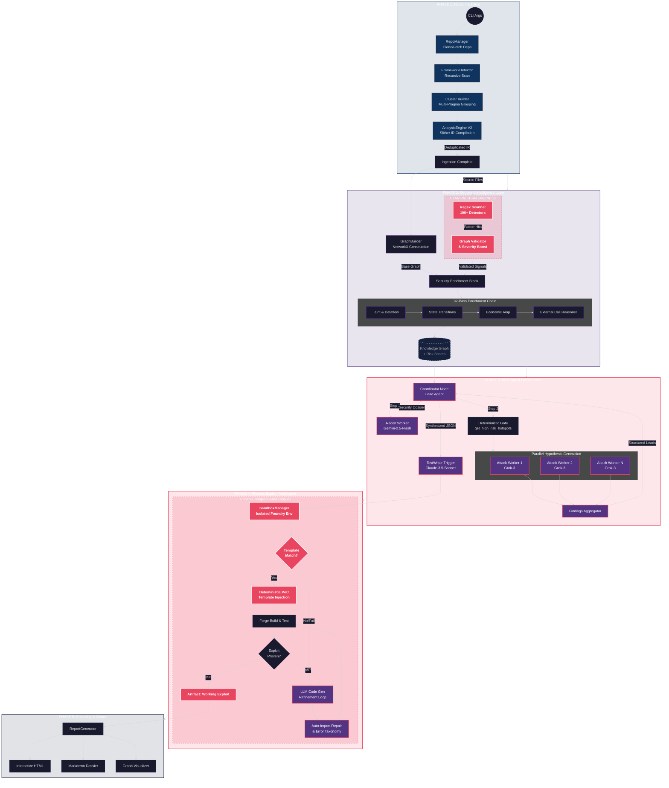

# Critikal v3.0

**AI-Powered Smart Contract Security System**  
*Human-in-the-loop • Multi-Agent • Graph-Powered • Pattern-Validated • Hallucination-Resistant*

**Last Updated**: March 14, 2026

## Overview & Vision

Critikal is a **human-in-the-loop multi-agent system** designed for high-signal Web3 bug bounty hunting and smart contract security analysis.

Instead of a single generalist LLM, Critikal uses a **Mixture of Experts (MoE)** architecture where specialized agents work together under a central **Coordinator**. The system is built on a rich **Knowledge Graph** to ground every claim in deterministic facts, eliminating hallucinations.

**v3 "Hybrid-Agnostic" Architecture** combines broad pattern coverage (100+ regex detectors) with deep graph reasoning (taint, reachability, exploit chains) — patterns seed the search space, the graph proves the results.

**Core Philosophy**:
- Signal-to-noise ratio > Autonomy
- Graph memory + deterministic rules first
- Pattern-first scanning → Graph-validated signals
- Template-first exploit proofs → LLM refinement
- Compiler (Foundry) as the ultimate truth oracle
- Human always in the loop for final validation

---

## Architecture

Critikal v3 is organized into seven major phases with two new engines:

| Phase | Name | Status |
|:------|:-----|:-------|
| 1–3 | Structural Intelligence Layer (Knowledge Graph + Security Signals + Exploit Feasibility) | ✅ Complete |
| 4 | Multi-Agent Orchestration (Lead Coordinator + Workers + Multi-Provider Routing) | ✅ Complete |
| 5 | Jury System (adversarial validation) | 🔄 In Progress |
| 6 | Exploit Proof Layer (Phoenix Test Writer + Error Taxonomy) | ✅ Complete |
| 7 | Reporting & Visualization (HTML Reports, Graph Exports) | ✅ Complete |
| **New** | **Titan Pattern Engine** (30+ Categories, up to ETH-094) | ✅ **Complete** |
| **New** | **API Key Pool** (Rotation, Cooldowns, Routing) | ✅ **Complete** |

---

## End-to-End Pipeline



### Pipeline Step Details

| Step | Component | Input | Output | Parallelism |
|------|-----------|-------|--------|-------------|
| 1.1 | `RepoManager` | Git URL | Cloned repo + deps | Sequential |
| 1.2 | `FrameworkDetector` | Repo path | Framework instances (type + subdir) | Sequential |
| 1.3 | `ClusterBuilder` | .sol files + pragmas | Compilation clusters | Sequential |
| 1.4 | `AnalysisEngine.run_analysis_v2()` | Clusters | Merged Slither object | Per-cluster |
| 2.1 | `GraphBuilder` | Slither IR | NetworkX DiGraph (2000+ nodes) | Sequential |
| **2.2** | **`pattern_scanner.scan_all_sources()`** | **File cache** | **`PatternHit[]` (raw signals)** | **Sequential** |
| **2.3** | **`GraphBuilder._integrate_pattern_hits()`** | **PatternHits + Graph** | **Validated hits → node metadata** | **Sequential** |
| 3.1 | `ReconWorker` | Contract names + addresses | Security Dossier | Sequential |
| 3.2 | `get_high_risk_hotspots()` | Graph | Scored hotspots (min 70) | Deterministic |
| 3.3 | `AttackHypothesisWorker` | Hotspot + recon context | Attack path + confidence | **Parallel** (all hotspots) |
| **3.4** | **`TestWriterWorker` (Phoenix)** | **Finding + repo** | **Proven exploit or failure** | **Sequential (template → LLM)** |
| 4.1 | Coordinator LLM | All results | JSON vulnerability report | Sequential (with fallback) |
| 7.1 | `ReportGenerator` | Findings + Graph | Structured HTML/MD reports | Sequential |

---

## Core Components

### 1. Knowledge Graph (The Brain)
- Built from **Slither** IR analysis
- **NetworkX** DiGraph with 4000+ nodes typical
- **6 node types**: Contract, Function, StateVariable, Modifier, StateTransition, ExternalTarget
- **10 edge types**: DEFINES, INHERITS, CALLS, READS, WRITES, HAS_MODIFIER, EXTERNAL_CALL, PERFORMS, AFFECTS, STATE_DEPENDENCY
- Rich security metadata / Advanced Graph Engine:
  - Exploit Chains & Feasibility Scoring: Penalizes uncertain chains, drops impossible ones.
  - Inter-procedural Taint & Dataflow Engine tagging storage sensitivity.
  - Accounting & Invariant Heuristics Engine.
  - External Call Reasoner: Risk assessment across `TOKEN_TRANSFER`, `ORACLE`, `UNTRUSTED_CONTRACT`, etc.
  - Contract tier classification (`CORE`, `FACTORY`, `LIBRARY`, `INFRA`) with tier-weighted impact scoring.
  - Read-only reentrancy risk detection across cross-contract view calls.
  - **Negative Safety Signals**: High-confidence evidence used to suppress false positives.
  - **SSA-Aware Access Control**: Dampened confidence for complex conditional permissioning.
  - **Governance Classification**: Specialized logic for decision-making & voting protocols.
  - **Pattern-validated signals** from the Titan Engine (30+ Categories).
- Incorporates the **Economic Amplification Engine** capping dynamic economic distortions directly into scoring calculations.
- Query API used by all agents (`get_high_risk_hotspots`, `get_function_context`, `get_pattern_hits`, etc.)

See **[Knowledge Graph Structure](#knowledge-graph-structure)** below for the complete schema.

### 2. Titan Pattern Engine (NEW in v3)
- **`src/pattern_scanner.py`** — 30+ regex-based vulnerability detectors covering:
  - **Reentrancy** (ETH-001/002): CEI violations, cross-function reentrancy
  - **Access Control** (ETH-005/006/007): Missing modifiers, tx.origin, selfdestruct
  - **Arithmetic** (ETH-013/014): Unchecked blocks, unsafe downcasts
  - **Oracle Manipulation** (ETH-024/028): Spot price reliance, stale Chainlink data
  - **Storage Risks** (ETH-019/029): delegatecall, uninitialized storage
  - **Logic Flaws** (ETH-035/040): Timestamp dependence, signature replay
  - **Token Issues** (ETH-050/052): Fee-on-transfer, rebasing token assumptions
  - **DeFi** (ETH-057/060): Vault share inflation, flash loan amplification
  - **Transient Storage** (ETH-070): TSTORE/TLOAD cross-call collision
  - **EIP-7702** (ETH-080/086): Broken EOA checks, delegated account risks
  - **ERC-4337** (ETH-090/091): Account abstraction validation-execution confusion
  - **Uniswap V4** (ETH-094): Hook callback reentrancy
- Produces `PatternHit` dataclasses — raw signals validated by the graph before scoring
- **Key differentiator**: Unlike tools that report raw regex matches, Critikal validates every hit against the graph's taint analysis, reachability, and access control context to eliminate false positives

### 3. Lead Coordinator
- Pure orchestrator utilizing **LangGraph** for global state management.
- **Multi-Provider Routing**: Dynamically assigns workers to specialized LLMs:
    - `RECON_MODEL_NAME` (e.g. `gemini-2.5-flash`)
    - `ATTACK_MODEL_NAME` (e.g. `grok-3`)
    - `TEST_WRITER_MODEL_NAME` (e.g. `claude-3.5-sonnet`)
- **API Key Pool**: Thread-safe rotating singleton managing `GEMINI_API_KEYS`, `OPENAI_API_KEYS`, and `ANTHROPIC_API_KEYS`.
    - Automated round-robin rotation.
    - Rate-limit (429) detection with configurable cooldowns (benchmarking).
- Analyzes disagreement to compute `should_escalate_to_human()`.
- Triggers **Phase 7** reporting execution via `ReportGenerator`.

### 4. Workers (Mixture of Experts)

**Recon Worker**
- Gathers protocol intelligence (RAG + Etherscan history)
- Classifies protocol type (Vault, DEX, Lending, etc.)
- Produces Security Dossier for downstream workers

**Attack Hypothesis Worker**
- Takes hotspots + recon context
- Generates structured vulnerability hypotheses
- Must cite real node IDs from the graph
- Produces `attack_path` and confidence score
- Safely handles API downtime and transient timeouts natively.

**Test Writer Worker — Phoenix Loop** (v3 Upgrade)
- **Attempt 1 (Template-First)**: Selects from **12 deterministic PoC templates** (`poc_templates.py`) based on vulnerability class.
- **Attempts 2-6 (LLM Refinement)**: Uses an **Error Taxonomy** to inject targeted fix guidelines for specific compiler errors (e.g. Error 2333, 6160, 5883).
- **Authenticity Validation**: Prevents LLM from passing tests by redefining target contracts or fabricating shadow mocks.
- **Guard Hit Detection**: Aborts retry loops when real contract protections (e.g. `Initializable`) are encountered.
- **Timelock Support**: Automatically detects and bypasses time-locks using `vm.warp` injections.
- **Bridge Mode**: Support for legacy projects (`0.5.x`-`0.7.x`) via `deployCode()` and `BridgeInterfaces.sol` generation.
- **Import Repair**: Resolves file-path and dependency context issues automatically.
- Uses `tempfile` isolated environments via `SandboxManager`.

### 5. Economic Amplification Engine
- Analyzes tainted logic within nodes leveraging the Graph.
- Detects denominator manipulations, rounding/precision drifts, and unbounded mint configurations.
- Imposes an `economic_impact_score` multiplier onto baseline scores mapping mathematically vulnerable constructs prior to Hypothesis generation.

### 6. Ingestion Engine (v2)
- **Framework Detection**: Recursive scan for Foundry/Hardhat/Brownie inside complex repos
- **Cluster Compilation**: Groups files by pragma version + import graph
- **Memory Guard**: Classifies repos by size preventing runaway states
- **Contract Deduplication**: Merges overlapping Slither objects seamlessly

---

## Knowledge Graph Structure

The Knowledge Graph is a **NetworkX DiGraph** built from Slither IR. Every node and edge carries typed metadata used for deterministic vulnerability detection and hotspot ranking.

### Node Types

#### Contract
- **ID format**: `ContractName`
- **Properties**: `name`, `is_upgradeable`, `is_library`, `is_interface`, `tier` (`CORE`|`FACTORY`|`LIBRARY`|`INFRA`), `privileged_roles`

#### Function
- **ID format**: `ContractName::FunctionName`
- Contains metadata for **Attack surface**, **State mutation**, **External calls**, **Access control**, **Reentrancy**, **Reachability**, and **Privilege**.
- **Epic 6**: `has_array_length_mutation`, `delegatecall_storage_risk`
- **Epic 8 Oracle**: `uses_spot_price_oracle`, `uses_safe_oracle`, `uses_twap_oracle`, `oracle_manipulation_risk`, `twap_window_short`
- **Epic 8 Arithmetic & Signature**: `division_before_multiplication`, `unsafe_type_cast`, `signature_replay_risk`
- **Taint Analysis**: `taint_sources`, `tainted_state_writes`, `taint_critical_paths`, `unchecked_external_return`
- **Economic**: `unbounded_inflation_risk`, `economic_impact_score`
- **Pattern Hits** (v3): `pattern_hits` (count), `pattern_hit_details` (list of validated PatternHit metadata), `pattern_categories` (set of matched categories)
- **Risk scores**: `structural_score`, `exploitability_score`, `impact_score`, `economic_impact_score`, `final_score`

*(StateVariable, Modifier, StateTransition, and ExternalTarget follow analogous deep IR categorization methodologies, referencing inter-contract dependencies and bounds.)*

### Graph Topology

```
Contract ──DEFINES──► Function
Contract ──INHERITS─► Contract
Contract ──HAS_MODIFIER──► Modifier

Function ──CALLS──► Function            (internal calls)
Function ──READS──► StateVariable
Function ──WRITES─► StateVariable       (legacy, kept for backward compat)
Function ──PERFORMS──► StateTransition ──AFFECTS──► StateVariable
Function ──EXTERNAL_CALL──► Function    (resolved cross-contract call)
Function ──EXTERNAL_CALL──► ExternalTarget  (unresolved target)
Function ──STATE_DEPENDENCY──► Function (cross-function dependency)
```

### Risk Score Formula (complete)

Risk scoring has three phases:
1. **Pre-scoring**: Deterministic structural signals added directly to `risk_score` per-detector
2. **Pattern boost** (v3): Validated pattern hits boost `structural_score` by severity (CRITICAL: +15, HIGH: +10, MEDIUM: +5)
3. **Global scoring** (`_compute_global_risk_scores`): Multiplied by Exploit Feasibility, Economic Amplification (1.0-1.5x), and Impact severity

### Hotspot Selection Gate

A function becomes a hotspot only if ALL conditions pass:
1. `final_score >= 70`
2. `structural_score >= 40`
3. `exploitability_score >= 30`
4. NOT `is_view_or_pure`
5. NOT `is_constructor`
6. NOT matching test/mock/fuzzing contract name patterns
7. NOT heavily guarded by initializer macros securely preventing reuse.
8. NOT in a `LIBRARY`-tier contract

---

## Project Structure

```
Critikal/
├── src/
│   ├── main.py                         # CLI entry point
│   ├── graph_builder.py                # Knowledge Graph construction (5400+ lines)
│   ├── pattern_scanner.py              # Titan Pattern Engine (30+ detectors)  ← NEW v3
│   ├── economic_analyzer.py            # Economic Amplification Engine
│   ├── analysis_engine.py              # Slither compilation orchestrator
│   ├── repo_manager.py                 # Git clone + dependency management
│   ├── hotspot_engine.py               # Hotspot selection logic
│   ├── agents/
│   │   ├── lead_agent.py               # LangGraph Coordinator
│   │   └── workers/
│   │       ├── attack_hypothesis_worker.py
│   │       ├── recon_worker.py
│   │       ├── test_writer_worker.py   # Phoenix Test Writer
│   │       ├── poc_templates.py        # 12 deterministic PoC templates  ← NEW v3
│   │       ├── test_writer_sandbox.py  # Foundry sandbox isolation
│   │       ├── test_writer_prompts.py  # LLM prompt engineering
│   │       └── bridge_interface_generator.py  # Legacy Solidity bridge
│   ├── ingestion/                      # Framework detection, clustering
│   ├── knowledge/                      # RAG system (ChromaDB)
│   ├── models/                         # Pydantic schemas
│   ├── reporting/                      # HTML/MD report generation
│   └── utils/
│       ├── graph_queries.py            # Deterministic query API
│       └── token_counter.py            # LLM token tracking
├── tests/                              # 554 tests (40 test files)
│   ├── test_pattern_scanner.py         # Titan Engine tests (16 cases)  ← NEW v3
│   ├── test_taint_engine.py            # Inter-procedural taint tests
│   ├── test_accounting_invariant_engine.py
│   ├── test_feasibility.py             # Exploit chain feasibility
│   ├── test_economic_analyzer.py       # Economic amplification tests
│   ├── test_access_control.py          # Modifier extraction + guards
│   ├── test_external_call_reasoner.py  # Call classification tests
│   └── ... (33 more test files)
└── pyproject.toml
```

---

## Tech Stack

- **Language**: Python 3.12+
- **Orchestration**: LangGraph + LangChain
- **Graph**: NetworkX
- **Static Analysis**: Slither
- **Pattern Scanning**: Custom regex engine (Titan, 670 lines, up to ETH-094)
- **Testing**: Foundry (Forge)
- **Vector DB**: ChromaDB
- **Embeddings**: all-MiniLM-L6-v2
- **LLMs**:
  - Lead & Multi-Agent Coordinator: `gemini-2.5-pro` (v3 default)
  - Workers (Defaults): `gemini-2.5-flash` (Recon), `grok-3` (Attack), `claude-3.5-sonnet` (TestWriter)
- **Models**: Pydantic for strict schemas
- **Testing**: pytest (573 collected tests across 40 files)

---

## Quick Start

```bash
# 1. Clone & install
git clone https://github.com/yourusername/Critikal.git
cd Critikal
pip install -e .

# 2. Add API keys to .env
GOOGLE_API_KEY=...
GOOGLE_API_KEYS=key1,key2,key3  # optional pool for rotation
XAI_API_KEY=...                 # for Grok-3 (Attack Worker)
ANTHROPIC_API_KEY=...           # for Claude-3.5-Sonnet (TestWriter)

# 3. Configure Worker Models (defaults used if omitted)
RECON_MODEL_NAME=gemini-2.5-flash
ATTACK_MODEL_NAME=grok-3
TEST_WRITER_MODEL_NAME=claude-3.5-sonnet

# 4. Run on any repo
python -m src.main --repo https://github.com/theredguild/damn-vulnerable-defi
```

## Current Status (March 5, 2026)

- **Phase 1–3**: Complete (Rich Knowledge Graph, advanced security signals, Exploit Feasibility Validations, Economic Amplification Engine, **Titan Pattern Engine**)
- **Phase 4**: Complete (MoE + Coordinator + Recon + Attack Hypothesis with **Multi-Provider Routing** and API Key Pooling)
- **Phase 5**: Partially Complete (Jury models validation architecture in progress)
- **Phase 6**: Complete! **Phoenix Test Writer** with template-first loop, bridge-mode testing, guard hit aborts, error taxonomy inference, and full sandbox automations preventing fake test proofs.
- **Phase 7**: Complete (Structured HTML output, detailed graphing representations via `ReportGenerator`)
- **Ingestion Engine v2**: Complete
- **Titan Pattern Engine**: Complete (30+ Categories, graph-validated, integrated into scoring)
- **Phoenix Template Library**: Complete (12 deterministic PoC templates for instant exploit generation)
- **Total Tests**: 573 collected across 40 test files

## Roadmap

- [x] Phase 4 — Multi-Agent Orchestration
- [x] Epic 6 — StateTransition Nodes (AlienCodex, delegatecall storage collision)
- [x] Epic 7 — Contract Tier Classification (tier-weighted risk)
- [x] Epic 8 — Semantic Vulnerability Detection (oracle, arithmetic, signature)
- [x] Ingestion Engine v2 — Cluster-based compilation
- [x] Advanced Graph Engine — Precision Taints, Exploit Chains, External Reasoner
- [x] Story 6.4 — Confidence Adjustment, Test Writer Hardening, Mock Fabrications Prevention
- [x] Phase 7 — Interactive HTML / Graphical Reporting Pipeline
- [x] **v3: Titan Pattern Engine** — 30+ regex detectors, graph-validated signals
- [x] **v3: Phoenix Template-First Loop** — 12 deterministic PoC templates, template → LLM fallback
- [ ] v3: Hydra Multi-Tool Orchestration (Slither + Aderyn + Mythril)
- [ ] v3: Medusa Dynamic Fuzzing Layer (invariant test generation)
- [ ] v3: Oracle Economic Simulation (price-impact modeling)
- [ ] Phase 5 — Full Adversarial Jury System Implementation
- [ ] SaaS / Hosted API Version

---

*Critikal — Turning AI into a real smart contract security weapon.*  
*Built with ❤️ for the Web3 security community.*
