# Penteam v2.0

**AI-Powered Smart Contract Security System**  
*Human-in-the-loop • Multi-Agent • Graph-Powered • Hallucination-Resistant*

**Last Updated**: February 25, 2026

## Overview & Vision

Penteam is a **human-in-the-loop multi-agent system** designed for high-signal Web3 bug bounty hunting and smart contract security analysis.

Instead of a single generalist LLM, Penteam uses a **Mixture of Experts (MoE)** architecture where specialized agents work together under a central **Coordinator**. The system is built on a rich **Knowledge Graph** to ground every claim in deterministic facts, eliminating hallucinations.

**Core Philosophy**:
- Signal-to-noise ratio > Autonomy
- Graph memory + deterministic rules first
- Adversarial Jury layer (different model families)
- Compiler (Foundry) as the ultimate truth oracle
- Human always in the loop for final validation

---

## Architecture

Penteam is divided into clear phases:

- **Phase 1–3**: Structural Intelligence Layer (Knowledge Graph + deterministic security signals)
- **Phase 4**: Multi-Agent Orchestration (Lead Coordinator + specialized Workers)
- **Phase 5**: Jury System (adversarial validation — in progress)
- **Phase 6**: Exploit Proof Layer (Test Writer Worker — **live**)
- **Phase 7+**: Confidence Scoring, Reports, SaaS (planned)

---

## End-to-End Pipeline

```mermaid
flowchart TB
    %% ─── PHASE 1: INGESTION ────────────────────────────────
    subgraph INGESTION["Phase 1 — Repository Ingestion"]
        direction TB
        A1["🔗 Git Clone + Submodules"]
        A2["📦 Dependency Install\n(npm / yarn / forge install)"]
        A3["🔍 Framework Detection\n(Foundry / Hardhat / Brownie)\nRecursive subdirectory scan"]
        A4["📐 Repo Size Classification\n(small / medium / large / xlarge)"]
        A5["🧩 Cluster Builder\nGroup by pragma + import graph"]
        A6["⚙️ Multi-Pragma Compilation\nFramework-first → cluster fallback\nsolc auto-switching per pragma"]
        A7["🔬 Slither Static Analysis\nIR parsing per cluster"]
        A8["🧹 Contract Deduplication\nMerge overlapping Slither objects"]
        A9["📊 Ingestion Report\nclusters / contracts / warnings"]

        A1 --> A2 --> A3 --> A4 --> A5 --> A6 --> A7 --> A8 --> A9
    end

    %% ─── PHASE 2: KNOWLEDGE GRAPH ──────────────────────────
    subgraph GRAPH["Phase 2 — Knowledge Graph Construction"]
        direction TB
        B1["🏗️ GraphBuilder\nNetworkX DiGraph"]
        B2["📍 Node Creation\nContracts • Functions\nState Variables • Modifiers"]
        B3["🔗 Edge Creation\nCALLS • READS • WRITES\nHAS_MODIFIER • INHERITS"]
        B4["🛡️ Security Metadata Enrichment\nReentrancy risk • CEI violations\nUnprotected mutators\nPrivilege escalation\nWrite propagation"]
        B5["📈 Risk Scoring\nComposite score per function\n(0-100)"]

        B1 --> B2 --> B3 --> B4 --> B5
    end

    %% ─── PHASE 3: COORDINATOR ──────────────────────────────
    subgraph COORD["Phase 3 — Coordinator Orchestration"]
        direction TB

        C1["🕵️ Step 1: Recon Worker\nProtocol classification\nRAG knowledge retrieval\nEtherscan on-chain history\n→ Security Dossier"]

        C2["🎯 Step 2: Hotspot Detection\nget_high_risk_hotspots()\nDeterministic graph query\nmin_score=70"]

        subgraph ATTACK["Step 3: Attack Hypothesis Workers"]
            direction LR
            D1["Worker 1\nreentrancy"]
            D2["Worker 2\naccess control"]
            D3["Worker N\n..."]
        end

        C3["📋 Step 4: Build Findings\nFilter confidence > 0\nSort by confidence desc\nAttach evidence nodes"]

        C4["🧠 Step 5: LLM Synthesis\nCoordinator LLM\nJSON vulnerability report\nSeverity • Root cause\nImpact assessment"]

        subgraph TESTWRITER["Step 6: TestWriter — Exploit Proof"]
            direction TB
            E1["🏗️ Sandbox Setup\nCopy repo (Foundry root)\nSymlink lib/ • Wipe test/\nClean isolated environment"]
            E2["📝 Collect Source + Deps\nResolve target contract\nFollow import graph\nRemappings from foundry.toml"]
            E3["🤖 LLM: Generate Test\nFoundry PoC with\nfunction test_exploit()"]
            E4["✏️ Auto-Correct Imports\nFix paths from\nremappings.txt"]
            E5["🔨 forge test\n--match-test test_exploit\nCompile + run in one step"]
            E6{"✅ Exploit\nproven?"}
            E7["📤 Return Result\ntest_code + logs +\nconfidence adjustment"]
            E8["🔄 Retry with errors\nMax 6 attempts\nError history → LLM"]

            E1 --> E2 --> E3 --> E4 --> E5 --> E6
            E6 -->|Yes| E7
            E6 -->|No| E8 --> E3
        end

        C1 --> C2 --> ATTACK --> C3 --> C4 --> TESTWRITER
    end

    %% ─── PHASE 4: OUTPUT ───────────────────────────────────
    subgraph OUTPUT["Phase 4 — Final Output"]
        direction TB
        F1["📊 Vulnerability Report\n• PROVEN exploits (test code)\n• HIGH-confidence leads\n• Risk landscape summary"]
        F2["🚨 Human Escalation\nIf findings.confidence ≥ threshold"]
        F3["🗂️ Structured Data\nFindings + test code +\nlogs + graph export"]

        F1 --> F2
        F1 --> F3
    end

    %% ─── CONNECTIONS ───────────────────────────────────────
    INGESTION --> GRAPH
    GRAPH --> COORD
    COORD --> OUTPUT

    %% ─── STYLING ───────────────────────────────────────────
    classDef phase1 fill:#1a1a2e,stroke:#16213e,color:#e4e4e4
    classDef phase2 fill:#0f3460,stroke:#16213e,color:#e4e4e4
    classDef phase3 fill:#533483,stroke:#16213e,color:#e4e4e4
    classDef phase4 fill:#e94560,stroke:#16213e,color:#e4e4e4

    class INGESTION phase1
    class GRAPH phase2
    class COORD phase3
    class OUTPUT phase4
```



### Pipeline Step Details

| Step | Component | Input | Output | Parallelism |
|------|-----------|-------|--------|-------------|
| 1.1 | `RepoManager` | Git URL | Cloned repo + deps | Sequential |
| 1.2 | `FrameworkDetector` | Repo path | Framework instances (type + subdir) | Sequential |
| 1.3 | `ClusterBuilder` | .sol files + pragmas | Compilation clusters | Sequential |
| 1.4 | `AnalysisEngine.run_analysis_v2()` | Clusters | Merged Slither object | Per-cluster |
| 2.1 | `GraphBuilder` | Slither IR | NetworkX DiGraph (2000+ nodes) | Sequential |
| 3.1 | `ReconWorker` | Contract names + addresses | Security Dossier | Sequential |
| 3.2 | `get_high_risk_hotspots()` | Graph | Scored hotspots (min 70) | Deterministic |
| 3.3 | `AttackHypothesisWorker` | Hotspot + recon context | Attack path + confidence | **Parallel** (all hotspots) |
| 3.4 | `TestWriterWorker` | Finding + repo | Proven exploit or failure | Sequential (per finding) |
| 4.1 | Coordinator LLM | All results | JSON vulnerability report | Sequential |

---

## Core Components

### 1. Knowledge Graph (The Brain)
- Built from **Slither** IR analysis
- **NetworkX** DiGraph with 4000+ nodes typical
- Nodes: Contracts, Functions, State Variables, Modifiers
- Edges: `CALLS`, `READS`, `WRITES`, `HAS_MODIFIER`, `INHERITS`, etc.
- Rich security metadata:
  - Reentrancy risk, CEI violations, unprotected mutators, privilege escalation, reachability, write propagation, etc.
- Query API used by all agents (`get_high_risk_hotspots`, `get_function_context`, etc.)

### 2. Lead Coordinator
- Pure orchestrator (never analyzes code directly)
- Maintains global state using LangGraph
- Spawns workers in parallel
- Synthesizes findings
- Decides escalation to human
- Uses only high-level summary tools

### 3. Workers (Mixture of Experts)

**Recon Worker**
- Gathers protocol intelligence (RAG + Etherscan history)
- Classifies protocol type (Vault, DEX, Lending, etc.)
- Produces Security Dossier for downstream workers

**Attack Hypothesis Worker**
- Takes hotspots + recon context
- Generates structured vulnerability hypotheses
- Must cite real node IDs from the graph
- Produces `attack_path` and confidence score

**Test Writer Worker** (Live)
- Receives a finding
- Generates Foundry test code
- Runs isolated compile → test → fix loop (max 6 attempts)
- Uses real `forge build` and `forge test`
- Returns proven exploit or detailed failure reason
- Sandboxed using `tempfile` + `SandboxManager`

### 4. Ingestion Engine (v2)
- **Framework Detection**: Recursive scan for Foundry/Hardhat/Brownie in subdirectories
- **Cluster Compilation**: Groups files by pragma version + import graph
- **Framework-First Strategy**: Compiles framework directories as whole units
- **Multi-Pragma Support**: Auto-switches solc per compilation cluster
- **Memory Guard**: Classifies repos by size, prevents memory explosions
- **Contract Deduplication**: Merges overlapping Slither objects after multi-cluster compilation

### 5. Tools & Infrastructure
- **Graph Tools**: `get_high_risk_hotspots`, `get_function_context`, etc.
- **RAG Librarian**: ChromaDB + embeddings for audit reports & docs
- **Etherscan Client**: On-chain history + exploit heuristics
- **AnalysisEngine**: Slither + auto solc version switching
- **RepoManager**: Git clone + Foundry/Hardhat dependency handling
- **SandboxManager**: Isolated Foundry environment per test attempt

### 6. Jury System (In Progress)
- Multi-model adversarial validation
- Sanity Jury (grounding)
- Logic Jury ("Prove this vulnerability is FALSE")
- Uses different model families (Gemini, GPT-5, Claude 4.6, Grok 4)

---

## Tech Stack

- **Language**: Python 3.12+
- **Orchestration**: LangGraph + LangChain
- **Graph**: NetworkX
- **Static Analysis**: Slither
- **Testing**: Foundry (Forge)
- **Vector DB**: ChromaDB
- **Embeddings**: all-MiniLM-L6-v2
- **LLMs**:
  - Lead & most workers: Gemini 2.5 / 3.0 Flash/Pro
  - Reasoning: GPT-5 / o3, Claude 4.6 Sonnet, Grok 4 Reasoning
- **Models**: Pydantic for strict schemas
- **Testing**: pytest (214+ tests, 100% pass)

---

## Quick Start

```bash
# 1. Clone & install
git clone https://github.com/yourusername/penteam.git
cd penteam
pip install -e .

# 2. Add API keys to .env
GOOGLE_API_KEY=...
XAI_API_KEY=...        # for Grok
# OPENAI_API_KEY=...

# 3. Run on any repo
python -m src.main --repo https://github.com/theredguild/damn-vulnerable-defi
```

## Current Status (February 25, 2026)

- **Phase 1–3**: Complete (Rich Knowledge Graph + all security signals)
- **Phase 4**: Complete (MoE + Coordinator + Recon + Attack Hypothesis)
- **Phase 6**: 75% Complete (Test Writer Worker live with sandbox + retry loop + multi-pragma support)
- **Ingestion Engine v2**: Complete (cluster-based compilation, framework detection, memory guard)
- **Total Tests**: 214 passing
- **Key Achievement**: Successfully generates real vulnerability hypotheses + Foundry tests on live protocols (tested on Ethernaut, DamnVulnerableDeFi)

## Roadmap

- [x] Phase 4 — Multi-Agent Orchestration
- [x] Phase 6.1–6.3 — Test Writer Core + Sandbox + Loop
- [x] Ingestion Engine v2 — Cluster-based compilation
- [ ] Story 6.4 — Confidence Adjustment & Integration
- [ ] Phase 5 — Full Jury System
- [ ] Phase 7 — Confidence Scoring & Reports
- [ ] SaaS / Hosted Version

---

*Penteam — Turning AI into a real smart contract security weapon.*  
*Built with ❤️ for the Web3 security community.*
