# Penteam v2.0

**AI-Powered Smart Contract Security System**  
*Human-in-the-loop • Multi-Agent • Graph-Powered • Hallucination-Resistant*

**Last Updated**: February 28, 2026

## Overview & Vision

Penteam is a **human-in-the-loop multi-agent system** designed for high-signal Web3 bug bounty hunting and smart contract security analysis.

Instead of a single generalist LLM, Penteam uses a **Mixture of Experts (MoE)** architecture where specialized agents work together under a central **Coordinator**. The system is built on a rich **Knowledge Graph** to ground every claim in deterministic facts, eliminating hallucinations.

**Core Philosophy**:
- Signal-to-noise ratio > Autonomy
- Graph memory + deterministic rules first
- Adversarial Jury layer (different model families)
- Compiler (Foundry) as the ultimate truth oracle
- Human always in the loop for final validation

---

## Architecture

Penteam is divided into clear phases:

- **Phase 1–3**: Structural Intelligence Layer (Knowledge Graph + deterministic security signals + Exploit Feasibility)
- **Phase 4**: Multi-Agent Orchestration (Lead Coordinator + specialized Workers)
- **Phase 5**: Jury System (adversarial validation — in progress)
- **Phase 6**: Exploit Proof Layer (Test Writer Worker — **live**)
- **Phase 7**: Reporting & Visualization (HTML Reports, Graph Exports — **live**)

---

## End-to-End Pipeline

```mermaid
flowchart TB
    %% ─── PHASE 1: INGESTION ────────────────────────────────
    subgraph INGESTION["Phase 1 — Repository Ingestion"]
        direction TB
        A1["🔗 Git Clone + Submodules"]
        A2["📦 Dependency Install\n(npm / yarn / forge install)"]
        A3["🔍 Framework Detection\n(Foundry / Hardhat / Brownie)\nRecursive subdirectory scan"]
        A4["📐 Repo Size Classification\n(small / medium / large / xlarge)"]
        A5["🧩 Cluster Builder\nGroup by pragma + import graph"]
        A6["⚙️ Multi-Pragma Compilation\nFramework-first → cluster fallback\nsolc auto-switching per pragma"]
        A7["🔬 Slither Static Analysis\nIR parsing per cluster"]
        A8["🧹 Contract Deduplication\nMerge overlapping Slither objects"]
        A9["📊 Ingestion Report\nclusters / contracts / warnings"]

        A1 --> A2 --> A3 --> A4 --> A5 --> A6 --> A7 --> A8 --> A9
    end

    %% ─── PHASE 2: KNOWLEDGE GRAPH ──────────────────────────
    subgraph GRAPH["Phase 2 — Knowledge Graph Construction"]
        direction TB
        B1["🏗️ GraphBuilder\nNetworkX DiGraph"]
        B2["📍 Node Creation\nContracts • Functions • State Variables\nModifiers • StateTransitions • ExternalTargets"]
        B3["🔗 Edge Creation\nCALLS • READS • WRITES • PERFORMS • AFFECTS\nHAS_MODIFIER • INHERITS • EXTERNAL_CALL"]
        B4["🛡️ Security Metadata Enrichment\nReentrancy • Privilege Escalation • Taint Analysis\nStateTransitions • Array Length Mutation\nExternal Call Reasoner • Economics"]
        B5["📈 Chain & Risk Scoring\nExploit Feasibility Validator\nEconomic Amplification Engine (1.0-1.5x)"]

        B1 --> B2 --> B3 --> B4 --> B5
    end

    %% ─── PHASE 3: COORDINATOR ──────────────────────────────
    subgraph COORD["Phase 3 — Coordinator Orchestration"]
        direction TB

        C1["🕵️ Step 1: Recon Worker\nProtocol classification\nRAG knowledge retrieval\nEtherscan on-chain history\n→ Security Dossier"]

        C2["🎯 Step 2: Hotspot Detection\nget_high_risk_hotspots()\nScore pre-filtered (min_score=70)"]

        subgraph ATTACK["Step 3: Attack Hypothesis Workers"]
            direction LR
            D1["Worker 1\nreentrancy"]
            D2["Worker 2\naccess control"]
            D3["Worker N\n..."]
        end

        C3["📋 Step 4: Build Findings\nFilter confidence > 0\nSort by confidence desc\nAttach evidence nodes"]

        C4["🧠 Step 5: LLM Synthesis\nCoordinator LLM\nJSON vulnerability report\nSeverity • Root cause\nImpact assessment"]

        subgraph TESTWRITER["Step 6: TestWriter — Exploit Proof"]
            direction TB
            E1["🏗️ Sandbox Setup\nCopy repo (Foundry root)\nSymlink lib/ • Wipe test/\nClean isolated environment"]
            E2["📝 Collect Source + Deps\nResolve target contract\nFollow import graph\nRemappings from foundry.toml"]
            E3["🤖 LLM: Generate Test\nFoundry PoC with\nfunction test_exploit()\n(Bridge & Modern modes)"]
            E4["✏️ Auto-Correct Imports\nFix paths from\nremappings.txt"]
            E5["🔨 forge test\nCompile + run in one step"]
            E6{"✅ Exploit\nproven?"}
            E7["📤 Return Result\nPROVEN test_code + logs"]
            E8["🔄 Error Loop & Guards\nCompiler Taxonomy Rules\nEarly exit on Guard hit\nMax 6 attempts"]

            E1 --> E2 --> E3 --> E4 --> E5 --> E6
            E6 -->|Yes| E7
            E6 -->|No| E8 --> E3
        end

        C1 --> C2 --> ATTACK --> C3 --> C4 --> TESTWRITER
    end

    %% ─── PHASE 4: OUTPUT ───────────────────────────────────
    subgraph OUTPUT["Phase 4 — Final Output & Reporting"]
        direction TB
        F1["📊 Vulnerability Report\n• PROVEN exploits (test code)\n• HIGH-confidence leads\n• Risk landscape summary"]
        F2["🚨 Human Escalation\nIf findings.confidence ambiguous\nShould_escalate_to_human"]
        F3["🗂️ Report Generation (Phase 7)\nInteractive HTML / Markdown\nVisual Graph Export\nWorking Exploit code extraction"]

        F1 --> F2
        F1 --> F3
    end

    %% ─── CONNECTIONS ───────────────────────────────────────
    INGESTION --> GRAPH
    GRAPH --> COORD
    COORD --> OUTPUT

    %% ─── STYLING ───────────────────────────────────────────
    classDef phase1 fill:#1a1a2e,stroke:#16213e,color:#e4e4e4
    classDef phase2 fill:#0f3460,stroke:#16213e,color:#e4e4e4
    classDef phase3 fill:#533483,stroke:#16213e,color:#e4e4e4
    classDef phase4 fill:#e94560,stroke:#16213e,color:#e4e4e4

    class INGESTION phase1
    class GRAPH phase2
    class COORD phase3
    class OUTPUT phase4
```



### Pipeline Step Details

| Step | Component | Input | Output | Parallelism |
|------|-----------|-------|--------|-------------|
| 1.1 | `RepoManager` | Git URL | Cloned repo + deps | Sequential |
| 1.2 | `FrameworkDetector` | Repo path | Framework instances (type + subdir) | Sequential |
| 1.3 | `ClusterBuilder` | .sol files + pragmas | Compilation clusters | Sequential |
| 1.4 | `AnalysisEngine.run_analysis_v2()` | Clusters | Merged Slither object | Per-cluster |
| 2.1 | `GraphBuilder` | Slither IR | NetworkX DiGraph (2000+ nodes) | Sequential |
| 3.1 | `ReconWorker` | Contract names + addresses | Security Dossier | Sequential |
| 3.2 | `get_high_risk_hotspots()` | Graph | Scored hotspots (min 70) | Deterministic |
| 3.3 | `AttackHypothesisWorker` | Hotspot + recon context | Attack path + confidence | **Parallel** (all hotspots) |
| 3.4 | `TestWriterWorker` | Finding + repo | Proven exploit or failure | Sequential (per finding) |
| 4.1 | Coordinator LLM | All results | JSON vulnerability report | Sequential (with fallback) |
| 7.1 | `ReportGenerator` | Findings + Graph | Structured HTML/MD reports | Sequential |

---

## Core Components

### 1. Knowledge Graph (The Brain)
- Built from **Slither** IR analysis
- **NetworkX** DiGraph with 4000+ nodes typical
- **6 node types**: Contract, Function, StateVariable, Modifier, StateTransition, ExternalTarget
- **10 edge types**: DEFINES, INHERITS, CALLS, READS, WRITES, HAS_MODIFIER, EXTERNAL_CALL, PERFORMS, AFFECTS, STATE_DEPENDENCY
- Rich security metadata / Advanced Graph Engine:
  - Exploit Chains & Feasibility Scoring: Penalizes uncertain chains, drops impossible ones.
  - Inter-procedural Taint & Dataflow Engine tagging storage sensitivity.
  - Accounting & Invariant Heuristics Engine.
  - External Call Reasoner: Risk assessment across `TOKEN_TRANSFER`, `ORACLE`, `UNTRUSTED_CONTRACT`, etc.
  - Contract tier classification (`CORE`, `FACTORY`, `LIBRARY`, `INFRA`) with tier-weighted impact scoring.
- Incorporates the **Economic Amplification Engine** capping dynamic economic distortions directly into scoring calculations.
- Query API used by all agents (`get_high_risk_hotspots`, `get_function_context`, etc.)

See **[Knowledge Graph Structure](#knowledge-graph-structure)** below for the complete schema.

### 2. Lead Coordinator
- Pure orchestrator (never analyzes code directly)
- Maintains global state using LangGraph
- Spawns workers in parallel
- Synthesizes findings and handles LLM synthesis fallbacks
- Analyzes disagreement to compute `should_escalate_to_human()`
- Triggers **Phase 7** reporting execution via `ReportGenerator`.

### 3. Workers (Mixture of Experts)

**Recon Worker**
- Gathers protocol intelligence (RAG + Etherscan history)
- Classifies protocol type (Vault, DEX, Lending, etc.)
- Produces Security Dossier for downstream workers

**Attack Hypothesis Worker**
- Takes hotspots + recon context
- Generates structured vulnerability hypotheses
- Must cite real node IDs from the graph
- Produces `attack_path` and confidence score
- Safely handles API downtime and transient timeouts natively.

**Test Writer Worker** (Live)
- Receives a finding
- Generates Foundry test code using either **Modern (`^0.8.0`)** or **Bridge Mode (`deployCode()`)** for legacy projects (`0.5.x`-`0.7.x`).
- Validates compiler output iteratively: maps exact errors (Cast fix, Interface omission) using strict Error Rules.
- Safely detects falsification signals (e.g. hitting `already initialized` guards) to prevent retry loops.
- Authenticity validation: Prevents LLM from passing tests by fabricating shadow mocks.
- Automated import repair resolving missing `forge-std` contexts.
- Uses `tempfile` isolated environments via `SandboxManager`.

### 4. Economic Amplification Engine
- Analyzes tainted logic within nodes leveraging the Graph.
- Detects denominator manipulations, rounding/precision drifts, and unbounded mint configurations.
- Imposes an `economic_impact_score` multiplier onto baseline scores mapping mathematically vulnerable constructs prior to Hypothesis generation.

### 5. Ingestion Engine (v2)
- **Framework Detection**: Recursive scan for Foundry/Hardhat/Brownie inside complex repos
- **Cluster Compilation**: Groups files by pragma version + import graph
- **Memory Guard**: Classifies repos by size preventing runaway states
- **Contract Deduplication**: Merges overlapping Slither objects seamlessly

---

## Knowledge Graph Structure

The Knowledge Graph is a **NetworkX DiGraph** built from Slither IR. Every node and edge carries typed metadata used for deterministic vulnerability detection and hotspot ranking.

### Node Types

#### Contract
- **ID format**: `ContractName`
- **Properties**: `name`, `is_upgradeable`, `is_library`, `is_interface`, `tier` (`CORE`\|`FACTORY`\|`LIBRARY`\|`INFRA`), `privileged_roles`

#### Function
- **ID format**: `ContractName::FunctionName`
- Contains metadata for **Attack surface**, **State mutation**, **External calls**, **Access control**, **Reentrancy**, **Reachability**, and **Privilege**.
- **Epic 6**: `has_array_length_mutation`, `delegatecall_storage_risk`
- **Epic 8 Oracle**: `uses_spot_price_oracle`, `uses_safe_oracle`, `uses_twap_oracle`, `oracle_manipulation_risk`, `twap_window_short`
- **Epic 8 Arithmetic & Signature**: `division_before_multiplication`, `unsafe_type_cast`, `signature_replay_risk`
- **Taint Analysis**: `taint_sources`, `tainted_state_writes`, `taint_critical_paths`, `unchecked_external_return`
- **Economic**: `unbounded_inflation_risk`
- **Risk scores**: `structural_score`, `exploitability_score`, `impact_score`, `economic_impact_score`, `final_score`

*(StateVariable, Modifier, StateTransition, and ExternalTarget follow analogous deep IR categorization methodologies, referencing inter-contract dependencies and bounds.)*

### Graph Topology

```
Contract ──DEFINES──► Function
Contract ──INHERITS─► Contract
Contract ──HAS_MODIFIER──► Modifier

Function ──CALLS──► Function            (internal calls)
Function ──READS──► StateVariable
Function ──WRITES─► StateVariable       (legacy, kept for backward compat)
Function ──PERFORMS──► StateTransition ──AFFECTS──► StateVariable
Function ──EXTERNAL_CALL──► Function    (resolved cross-contract call)
Function ──EXTERNAL_CALL──► ExternalTarget  (unresolved target)
Function ──STATE_DEPENDENCY──► Function (cross-function dependency)
```

### Risk Score Formula (complete)

Risk scoring has two phases: **pre-scoring** (added directly to `risk_score` per-detector) and **global scoring** (`_compute_global_risk_scores`), multiplied dynamically.

The Final Score applies Exploit Feasibility, Economic Distortions, Structural Risks, and Impact severity rules prior to gatekeeping in Hotspots Selection. 

### Hotspot Selection Gate

A function becomes a hotspot only if ALL conditions pass:
1. `final_score >= 70`
2. `structural_score >= 40`
3. `exploitability_score >= 30`
4. NOT `is_view_or_pure`
5. NOT `is_constructor`
6. NOT matching test/mock/fuzzing contract name patterns
7. NOT heavily guarded by initializer macros securely preventing reuse. 
8. NOT in a `LIBRARY`-tier contract

---

## Tech Stack

- **Language**: Python 3.12+
- **Orchestration**: LangGraph + LangChain
- **Graph**: NetworkX
- **Static Analysis**: Slither
- **Testing**: Foundry (Forge)
- **Vector DB**: ChromaDB
- **Embeddings**: all-MiniLM-L6-v2
- **LLMs**:
  - Lead & most workers: Gemini 2.5 / 3.0 Flash/Pro
  - Reasoning: GPT-5 / o3, Claude 4.6 Sonnet
- **Models**: Pydantic for strict schemas
- **Testing**: pytest (225+ graph/structural tests, 100% pass)

---

## Quick Start

```bash
# 1. Clone & install
git clone https://github.com/yourusername/penteam.git
cd penteam
pip install -e .

# 2. Add API keys to .env
GOOGLE_API_KEY=...
XAI_API_KEY=...        # for Grok
# OPENAI_API_KEY=...

# 3. Run on any repo
python -m src.main --repo https://github.com/theredguild/damn-vulnerable-defi
```

## Current Status (February 28, 2026)

- **Phase 1–3**: Complete (Rich Knowledge Graph, advanced security signals, Exploit Feasibility Validations, and the Economic Amplification Engine)
- **Phase 4**: Complete (MoE + Coordinator + Recon + Attack Hypothesis with resilient worker timeouts/crash safety)
- **Phase 5**: Partially Complete (Jury models validation architecture in progress)
- **Phase 6**: Complete! Test Writer Worker is robust, incorporates bridge-mode testing, guard hit aborts, error taxonomy inference, and full sandbox automations preventing fake test proofs.
- **Phase 7**: Complete (Structured HTML output, detailed graphing representations via `ReportGenerator`)
- **Ingestion Engine v2**: Complete
- **Total Tests**: 225+ graph/structural tests passing (100% pass rate)

## Roadmap

- [x] Phase 4 — Multi-Agent Orchestration
- [x] Epic 6 — StateTransition Nodes (AlienCodex, delegatecall storage collision)
- [x] Epic 7 — Contract Tier Classification (tier-weighted risk)
- [x] Epic 8 — Semantic Vulnerability Detection (oracle, arithmetic, signature)
- [x] Ingestion Engine v2 — Cluster-based compilation
- [x] Advanced Graph Engine — Precision Taints, Exploit Chains, External Reasoner
- [x] Story 6.4 — Confidence Adjustment, Test Writer Hardening, Mock Fabrications Prevention
- [x] Phase 7 — Interactive HTML / Graphical Reporting Pipeline
- [ ] Phase 5 — Full Adversarial Jury System Implementation
- [ ] SaaS / Hosted API Version

---

*Penteam — Turning AI into a real smart contract security weapon.*  
*Built with ❤️ for the Web3 security community.*
