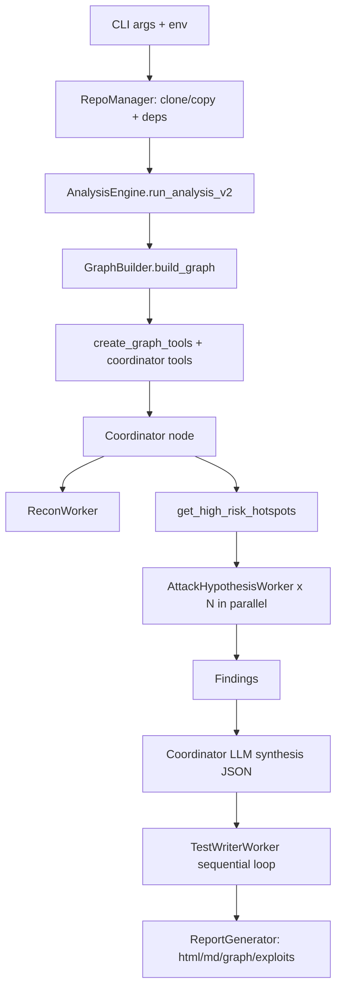
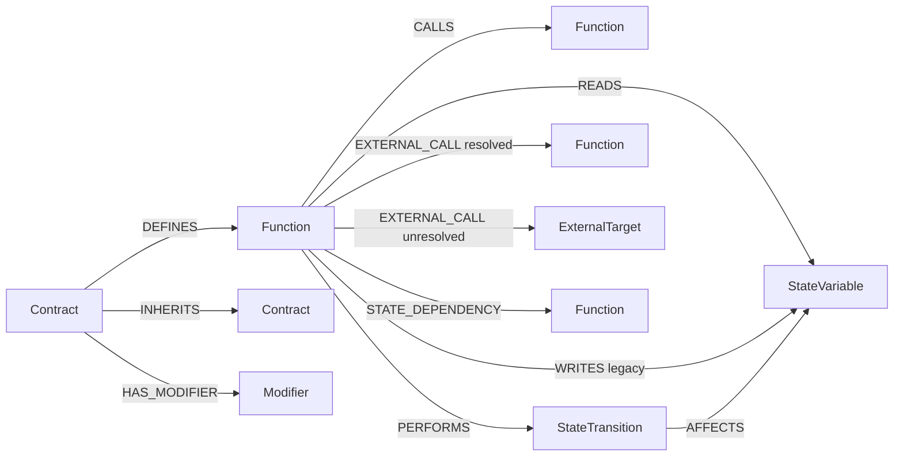

# Critikal Architecture (Code-First Spec)

Last verified from implementation in `src/` and tests in `tests/` on 2026-02-27.

This document is intentionally grounded in code behavior, not README status text.

## 1) System Overview

Critikal is a Python-based smart contract security pipeline that combines:
- repository ingestion + multi-strategy Slither compilation,
- a NetworkX knowledge graph with layered security enrichments,
- deterministic hotspot gating and graph query tools,
- multi-worker orchestration (Recon -> Attack Hypothesis -> Test Writer),
- and report generation (HTML/Markdown/graph + exploit artifacts).

Primary runtime entrypoint: `src/main.py`.

## 2) End-to-End Runtime Flow

Important runtime detail: the LangGraph topology is minimal (`START -> Coordinator -> END`), and most orchestration happens inside `coordinator_node` in `src/pipeline/lead_agent.py`.

## 3) Ingestion and Static Analysis

Core components:
- `src/repo_manager.py`
- `src/analysis_engine.py`
- `src/ingestion/*`

Implemented behavior:
- Detects frameworks recursively (`Foundry`, `Hardhat`, `Brownie`) via `FrameworkDetector`.
- Classifies repo size/memory posture with `MemoryGuard`.
- Uses framework-first compilation (compile framework roots as full units).
- Builds clusters for non-framework/orphan roots.
- Compiles with fallback strategies and merges successful Slither objects.
- Deduplicates overlapping contracts post-merge.
- Falls back to legacy pipeline if cluster path fails.

## 4) Knowledge Graph Architecture

Graph backend: `networkx.DiGraph` in `src/graph/ (modular)`.

### 4.1 Node Types (implemented)

- `contract`
- `function`
- `state_variable`
- `modifier`
- `state_transition`
- `external_target`

Canonical IDs:
- Contract: `ContractName`
- Function: `ContractName::functionName`
- StateVariable: `ContractName::variableName`
- Modifier: `ContractName::modifier::modifierName`
- StateTransition: `__st::{FunctionId}::{counter}`
- ExternalTarget: `__ext::{FunctionId}::{counter}`

ID normalization helper: `src/utils/node_ids.py` accepts dot format (`Contract.function`) and normalizes to canonical `::`.

### 4.2 Edge Types (implemented)

- `DEFINES` (Contract -> Function)
- `INHERITS` (Contract -> Contract)
- `CALLS` (Function -> Function; internal)
- `READS` (Function -> StateVariable)
- `WRITES` (Function -> StateVariable; legacy/backward-compatible)
- `HAS_MODIFIER` (Contract -> Modifier)
- `EXTERNAL_CALL` (Function -> Function or ExternalTarget)
- `PERFORMS` (Function -> StateTransition)
- `AFFECTS` (StateTransition -> StateVariable)
- `STATE_DEPENDENCY` (Function -> Function; shared-state dependency model)

### 4.3 Graph Topology

## 5) Graph Build / Enrichment Order (source of truth)

`GraphBuilder.build_graph()` currently executes this order:

1. base nodes + `DEFINES/INHERITS/CALLS/READS/WRITES`
2. storage mutation enrichment
3. internal call enrichment
4. state transition construction
5. write propagation
6. external reachability
7. access control enrichment
8. external call classification + CEI flags
9. oracle pattern detection
10. arithmetic pattern detection
11. signature replay pattern detection
12. deterministic reentrancy risk rule
13. privileged role detection
14. unprotected mutator detection
15. state variable reverse mapping
16. privilege escalation detection
17. state transition enrichment (privileged var effects)
18. array length mutation detection
19. delegatecall storage risk detection
20. contract tier classification
21. modifier equivalence classification
22. initializer guard detection
23. require-based access control detection
24. storage sensitivity tagging
25. inter-procedural taint propagation
26. state dependency graph construction
27. dangerous sequence detection
28. exploit chain generation
29. accounting/invariant heuristics
30. external call risk analyzer
31. global risk scoring
32. exploit target scoring

## 6) Risk Scoring and Hotspot Gate

### 6.1 Global function scoring

Computed in `GraphBuilder._compute_global_risk_scores()`:
- `structural_score`
- `exploitability_score`
- `impact_score`
- `final_score = round(0.40 * structural + 0.35 * exploitability + 0.25 * impact)`
- `risk_score` is preserved as alias to `final_score`.

Inputs include (implemented): reentrancy/CEI, privilege escalation, unprotected mutators, state transition attacker-input markers, taint/dataflow risks, dangerous sequence risks, accounting heuristics, external-call risks, and tier-weighted impact.

### 6.2 Exploit-target eligibility

Computed separately in `_compute_exploit_target_scores()`:
- `exploit_target_score`
- `send_to_exploit_writer` (default threshold 65)

### 6.3 Hotspot selection gate

`GraphQueries.get_high_risk_hotspots()` requires all by default:
- `final_score >= 70`
- `structural_score >= 40`
- `exploitability_score >= 30`
- `send_to_exploit_writer == True` (unless disabled in call)

Also excludes:
- view/pure functions,
- constructors,
- test/mock/fuzz artifacts by name/path filters,
- contracts classified as `LIBRARY`.

## 7) Query / Tool API Surface

Implemented in `src/utils/graph_queries.py` (class `GraphQueries` + wrappers).

Major categories:
- Function context/callgraph (`get_function_context`, `get_call_graph`, `get_callers`, `get_internal_calls`)
- Attack surface/access (`get_external_entry_points`, `get_access_control_summary`, `get_privileged_roles`, `get_unprotected_mutators`)
- External calls/reentrancy (`get_external_call_functions`, `get_external_call_edges`, `get_reentrancy_risks`, `get_cei_violations`)
- State transitions and Epic-6 style signals (`get_state_transitions`, `get_array_length_mutations`, `get_delegatecall_storage_risks`)
- Tier/guard precision (`get_contract_tiers`, `get_guarded_initializers`, `get_access_control_types`, `get_modifier_equivalences`, `get_safe_functions`)
- Taint/dataflow (`get_taint_critical_paths`, `get_storage_sensitivity_tags`, `get_tainted_variables`, `get_taint_risks`)
- Cross-function modeling (`get_state_dependencies`, `get_dangerous_sequences`, `get_exploit_chains`)
- Accounting/external risk/exploit target (`get_accounting_invariant_risks`, `get_external_call_risks`, `get_exploit_targets`)
- Hotspots (`get_high_risk_hotspots`)

Compatibility note: `get_function_context()` returns both `source_code` and `code`.

## 8) Agent Orchestration Architecture

Key modules:
- `src/main.py`
- `src/pipeline/lead_agent.py`
- `src/pipeline/workers/recon_worker.py`
- `src/pipeline/workers/attack_hypothesis_worker.py`
- `src/pipeline/workers/test_writer_worker.py`

Coordinator (`coordinator_node`) flow:
1. Recon Worker (protocol + optional on-chain enrichment).
2. Deterministic hotspot query.
3. Parallel attack-hypothesis workers for hotspots.
4. Findings creation/filtering.
5. Coordinator LLM synthesis into JSON leads (tool use disabled for final synthesis).
6. Sequential TestWriter execution for qualified findings, with confidence/status updates.
7. Report generation and persistence.

## 9) TestWriter and Sandbox

Core files:
- `src/pipeline/workers/test_writer_worker.py`
- `src/pipeline/workers/test_writer_sandbox.py`
- `src/pipeline/workers/test_writer_prompts.py`
- `src/pipeline/workers/bridge_interface_generator.py`

Implemented behavior:
- Isolated sandbox setup per run.
- Source gathering + signature context for target function/contract.
- Foundry test generation with retry loop.
- Compile/test-driven correction loop.
- Special handling for multi-pragma/legacy interface bridging.
- Returns exploit outcome, logs, generated test code, and confidence adjustment signals.

## 10) Reporting and Artifacts

Reporting stack:
- `src/reporting/report_generator.py`
- `src/reporting/html_report.py`
- `src/reporting/markdown_report.py`
- `src/reporting/graph_visualizer.py`

Output bundle includes:
- `report.html`
- `report.md`
- `graph.html` (interactive D3 view)
- exploit artifacts under report output directory

Default output root pattern: `data/reports/<repo_name>_<timestamp>/`.

## 11) Config / Runtime Requirements

From code and pyproject:
- Python 3.12+
- Slither + NetworkX
- LangGraph + LangChain integrations
- Chroma + sentence-transformers for RAG
- Required key in `main`: `GOOGLE_API_KEY`
- Optional contract-address input via CLI/env for recon enrichment

## 12) README Drift / Stale-Doc Corrections

Code-level deltas likely not captured by older docs:
- Graph build process is larger than the earlier "phase checklist" style docs (32 pass chain in implementation).
- Runtime LangGraph is intentionally minimal; orchestration complexity is in coordinator Python logic.
- Advanced layers are live in code: guard precision, taint engine, cross-function dependency/sequence/chains, accounting/invariant heuristics, external-call risk analyzer, exploit-target scoring.
- Reporting output is actively generated in coordinator flow.

## 13) Validation Sources

Primary code:
- `src/main.py`
- `src/analysis_engine.py`
- `src/graph/ (modular)`
- `src/utils/graph_queries.py`
- `src/pipeline/lead_agent.py`
- `src/pipeline/tools.py`
- `src/pipeline/workers/*`
- `src/reporting/*`

Representative tests:
- `tests/test_graph_queries.py`
- `tests/test_state_transitions.py`
- `tests/test_external_calls.py`
- `tests/test_reentrancy_rule.py`
- `tests/test_guard_precision_layer.py`
- `tests/test_taint_engine.py`
- `tests/test_cross_function_state.py`
- `tests/test_accounting_invariant_engine.py`
- `tests/test_attack_hypothesis_worker.py`
- `tests/test_recon_worker.py`
- `tests/test_test_writer_worker.py`
